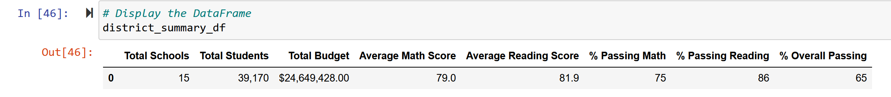
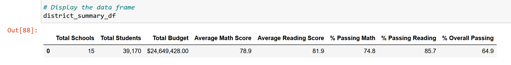
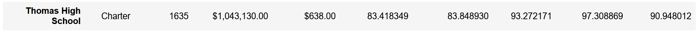

# School_District_Analysis

## Overview of Project: 
After the completion of the School District Analysis, evidence of academic dishonesty; specifically, the reading and math grades for Thomas High School ninth graders appear to have been altered. Although the school board does not know the full extent of the academic dishonesty, they want to uphold state-testing standards. Hence, the math and reading scores for the ninth graders at Thomas High School will be replaced with NaNs at this time.  Then, the analysis will be completed again. 

### Purpose: 
To find out what changes will occur to the overall school district analysis when the reading and math grades for the entire 9th grade class at Thomas High School are NaNs (not calculated). 

## Results:

**- How is the district summary affeacted?**

Evidenced by the below pictures, the overall district summary score was only lowered .1%.

*Original District Summary:*

*District Summary after replacing 9th grade math and reading results for Thomas High School with NaNs:*

**- How is the school summary affected?**

The overall passing grade Thomas High Shool was 90.94 in the original school summary, but was lowered slightly, to 90.64, after changing the results for the 9th grade reading and math scores to NaN.

*Original School Summary for Thomas High School:*

*School Summary for Thomas High School after replacing the reading and math scores with NANs:*

**- How does replacing the ninth graders’ math and reading scores affect Thomas High School’s performance relative to the other schools?**

It doesn't.  The change only decreased Thomas High Schools's overall performance by .3%, which didn't move it higher or lower in it's standing among the other schools in the district. 

**- How does replacing the ninth-grade scores affect the following:**

    •	Math and reading scores by grade
      All the math and reading scores will remain the same for all grades, expect the 9th grade.  
      Since the 9th grade scores for Thomas High School were NaNs (not counted), they show a NAN.
      
    •	Scores by school spending
      School spending figures remain the same as the only the 9th grade math and reading scores were NaNs, not any other information. 
      
    •	Scores by school size
      School size remains the same as the only the 9th grade math and reading scores were NaNs, not any other information.
      
    •	Scores by school type
      School type remains the same as the only the 9th grade math and reading scores were NaNs, not any other information.

### Summary:

There were four changes in the updated school district analysis after the reading and math scores for the night grade at Thomas High School were replaced with NaNs.
1. The scores for reading and math were listed as NAN for the 9th grade at Thomas High Schools.
2. The overall district summary score was lowered .1%.
3. The overall passing grade Thomas High Shool was 90.94 in the original school summary, but was lowered slightly, to 90.64, after changing the results for the 9th grade reading and math scores to NaNs.
4. All the math and reading scores will remain the same for all grades, expect the 9th grade. Since the 9th grade scores for Thomas High School were NaNs (not counted), they show a NAN.

